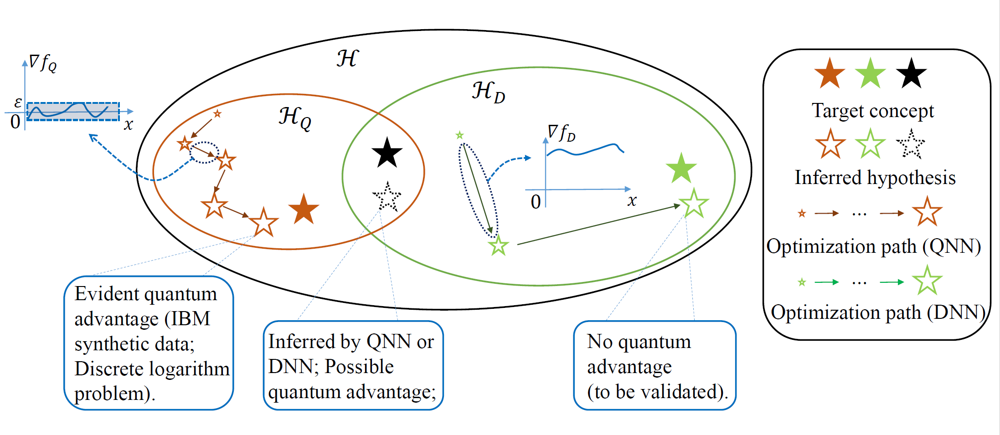

# The dilemma of quantum neural networks

This repository is the official implementation of *The dilemma of quantum neural networks*. 

>We systematically explore the learnability of quantum neural networks compared with classical neural networks. The overall hypothesis of quantum models and classical models is shown below:



## Requirements

To install requirements:

```setup
pip install -r requirements.txt
```

## Training & evaluation

### Quantum neural networks

Please refer to the directory `script`. There are two types of server, including Slurm server with slurm system and native linux server. 
- For Slurm server, script starts with prefix `slurm`, an example is given below:

```bash
bash script/qnn/slurm_run_qnn_all.sh
```

- Running on a native linux server, please refer to `script/run_example.sh`:
```bash
python --config-file config/xxx.yml --index 0
```

To run experiments with different models and settings, just update the configuration file `*.yml`.

### MLP

Please refer to `classical.py`

```bash
python classical.py
```

### CNN

Run the following script:

```bash
python Simple_QCNN_MNIST.py
```


## Datasets

- Quantum synthetic datasets: please refer to python file `data_gen.py`
```bash
python data_gen.py
```
- The Wine data: https://archive.ics.uci.edu/ml/datasets/wine
- MNIST: http://yann.lecun.com/exdb/mnist/

## Results

Please refer to paper.


## Contributing

>xxx. 
